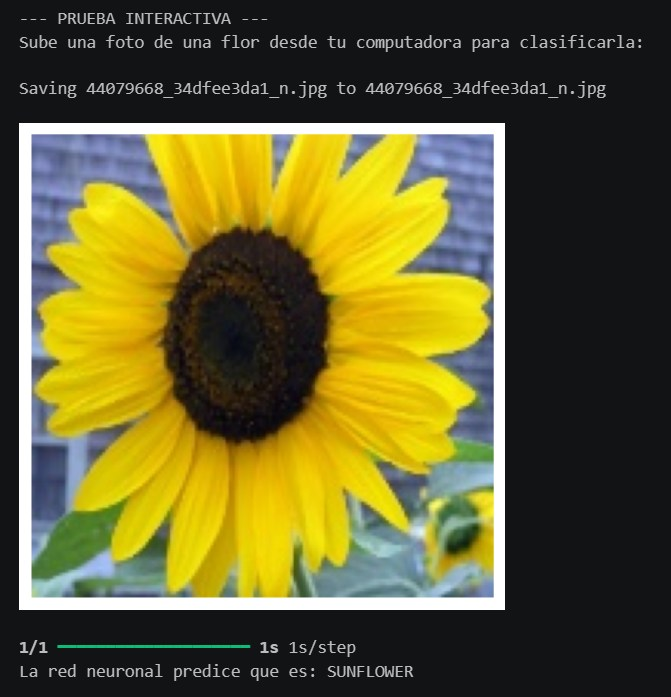

# Proyecto_Final_Sistemas_Distribuidos_CNN
En este repositorio se encuentran los notebooks, resultados, evidencias visuales y análisis realizados para evaluar el impacto de diferentes técnicas de preprocesamiento sobre una Red Neuronal Convolucional (CNN) aplicada a la clasificación de flores.

## Descripción del Proyecto

El objetivo de este proyecto es analizar el impacto de diferentes técnicas de preprocesamiento de imágenes sobre el desempeño de una Red Neuronal Convolucional (CNN) para la clasificación automática de flores.

Se implementaron dos técnicas de procesamiento digital de imágenes vistas durante el curso:

1. Filtro de Mediana.
2. Ecualización del Histograma en el espacio de color HSV.

Cada técnica fue aplicada a todas las imágenes del dataset antes del entrenamiento de la CNN para evaluar su influencia en las métricas de clasificación.

---

## Dataset Utilizado

Flowers Recognition Dataset

Clases:

* Daisy
* Dandelion
* Rose
* Sunflower
* Tulip
---

## Técnicas Implementadas

### 1. Filtro de Mediana

El filtro de mediana reemplaza cada píxel por la mediana de sus vecinos dentro de una ventana determinada.

#### Objetivo

* Reducir ruido en las imágenes.
* Conservar bordes importantes.
* Mantener la forma de pétalos y hojas.

#### Beneficio esperado

Mejorar la calidad visual de la imagen eliminando pequeñas variaciones que podrían afectar el aprendizaje de la CNN.

---

### 2. Ecualización del Histograma en HSV

La imagen es convertida al espacio de color HSV y posteriormente se aplica ecualización del histograma al canal V (brillo).

#### Objetivo

* Mejorar el contraste.
* Resaltar detalles visuales.
* Mantener la información cromática de las flores.

#### Beneficio esperado

Facilitar la identificación de patrones visuales por parte de la CNN.

---

## Estructura del Proyecto

```text
Proyecto/
│
├── imagenes/
│
├── Presentacion_Proyecto_Final_CNN.pptx
│
├── Proyecto_Final_RGB_Filtro_Mediana.ipynb
│
├── Proyecto_Final_RGB_Flowers.ipynb
│
├── Proyecto_Final_RGB_HSV.ipynb
│
├── README.md
│
├── preprocesamiento_Filtro_Mediana.ipynb
│
└── preprocesamiento_HSV.ipynb
```

---

## Requisitos

- Cuenta de Google
- Google Drive
- Google Colab
- Dataset Flowers Recognition

## Obtención del Dataset

Antes de ejecutar los scripts de preprocesamiento es necesario descargar el conjunto de datos utilizado en el proyecto.

Dataset utilizado:

[Flowers Recognition Dataset](https://www.kaggle.com/datasets/alxmamaev/flowers-recognition)

### Pasos

1. Ingresar al enlace del dataset en Kaggle.
2. Descargar el archivo comprimido (.zip).
3. Extraer el contenido del archivo.
4. Subir la carpeta `flowers` a tu Google Drive.
5. Verificar que la estructura de carpetas sea la siguiente:

```text
flowers/
│
├── daisy
├── dandelion
├── rose
├── sunflower
└── tulip
```

---
## Montar tu Google Drive en Google Colab

Acceder a Google Colab

https://colab.research.google.com/

Montar Google Drive

```python
from google.colab import drive
drive.mount('/content/drive')
```

---
## Entrenamiento de la CNN

1. Abrir el notebook `Proyecto_Final_RGB_Flowers.ipynb`.
2. Modificar la variable de ruta del dataset a tu google drive.

```python
DATASET_DIR = "/content/drive/MyDrive/flowers/"
```
4. Ejecutar todas las celdas del entrenamiento utilizando:

   * Dataset original (flowers/).
  
5. Realizar y Guardar el resultado de una Prueba Interactiva de la sección 8. del Entrenamiento de la CNN.

6. Registrar las métricas obtenidas en el entrenamiento.

Métricas evaluadas:
* Accuracy
* Precision
* Recall
* F1-Score
* Matriz de Confusión
---
---

7. Abrir el notebook `preprocesamiento_Filtro_Mediana.ipynb`.
8. Modificar la variable de ruta del dataset original a tu google drive.

```python
input_dir = "/content/drive/MyDrive/flowers"
```
9. Modificar la variable de ruta del dataset de salida a tu google drive.

```python
output_dir = "/content/drive/MyDrive/flowers_preprocesadas_Filtro_Mediana"
```
10. Ejecutar todas las celdas del preprocesamiento_Filtro_Mediana.ipynb

Resultado:

```text
flowers_preprocesadas_Filtro_Mediana/
│
├── daisy
├── dandelion
├── rose
├── sunflower
└── tulip
```
11. Regresar al notebook `Proyecto_Final_RGB_Flowers.ipynb`.
12. Modificar la variable de ruta del dataset a tu google drive.

```python
DATASET_DIR = "/content/drive/MyDrive/flowers_preprocesadas_Filtro_Mediana/"
```
13. Ejecutar todas las celdas del entrenamiento utilizando:

   * Dataset procesado con filtro de mediana (flowers_preprocesadas_Filtro_Mediana/).

14. Realizar y Guardar el resultado de una Prueba Interactiva de la sección 8. del Entrenamiento de la CNN.

15. Registrar las métricas obtenidas en el entrenamiento.

Métricas evaluadas:
* Accuracy
* Precision
* Recall
* F1-Score
* Matriz de Confusión
---
---

16. Abrir el notebook `preprocesamiento_HSV.ipynb`.
17. Modificar la variable de ruta del dataset original a tu google drive.

```python
input_dir = "/content/drive/MyDrive/flowers"
```
18. Modificar la variable de ruta del dataset de salida a tu google drive.

```python
output_dir = "/content/drive/MyDrive/flowers_preprocesadas_HSV"
```
19. Ejecutar todas las celdas de preprocesamiento_HSV.ipynb

Resultado:

```text
flowers_preprocesadas_HSV/
│
├── daisy
├── dandelion
├── rose
├── sunflower
└── tulip
```
20. Regresar al notebook `Proyecto_Final_RGB_Flowers.ipynb`.
21. Modificar la variable de ruta del dataset a tu google drive.

```python
DATASET_DIR = "/content/drive/MyDrive/flowers_preprocesadas_HSV/"
```
22. Ejecutar todas las celdas del entrenamiento utilizando:

   * Dataset procesado con ecualización HSV (flowers_preprocesadas_HSV/).

23. Realizar y Guardar el resultado de una Prueba Interactiva de la sección 8. del Entrenamiento de la CNN.

24. Registrar las métricas obtenidas en el entrenamiento.

Métricas evaluadas:
* Accuracy
* Precision
* Recall
* F1-Score
* Matriz de Confusión
---
---

## Comparación Visual

| Imagen Original | Filtro de Mediana | Ecualización HSV |
|----------------|------------------|------------------|
|  |  |  |

### Observaciones

- El filtro de mediana reduce ruido conservando los bordes principales de pétalos y hojas.
- La ecualización HSV mejora el contraste y resalta detalles visuales manteniendo la información de color.

## Comparación de Resultados

| Modelo Original | Filtro de Mediana | Ecualización HSV |
|----------------|------------------|------------------|
|  |  |  |

---

### Tabla Comparativa de Métricas

| Modelo | Accuracy | Macro Precision | Macro Recall | Macro F1-Score |
|----------|----------|----------|----------|----------|
| Original | 0.75 | 0.76 | 0.76 | 0.75 |
| Filtro de Mediana | 0.75 | 0.77 | 0.74 | 0.75 |
| Ecualización HSV | 0.70 | 0.71 | 0.70 | 0.69 |

## Observaciones

- El modelo original obtuvo un Accuracy de 75%, estableciendo la referencia para evaluar el impacto de las técnicas de preprocesamiento aplicadas.
- El Filtro de Mediana mantuvo el Accuracy global en 75%, igualando el desempeño del modelo original.
- Además, el Filtro de Mediana incrementó la Precision promedio de 0.76 a 0.77, lo que indica una ligera mejora en la capacidad del modelo para realizar clasificaciones correctas.
- La Ecualización del Histograma en HSV redujo el Accuracy a 70% y disminuyó las métricas de Precision, Recall y F1-Score, mostrando un impacto negativo en el desempeño de la CNN.
- Las matrices de confusión muestran que el Filtro de Mediana conservó una distribución de predicciones similar a la del modelo original, mientras que la Ecualización HSV incrementó la cantidad de errores de clasificación entre distintas clases.
- La clase Rose presentó la mayor dificultad de clasificación en los tres experimentos, siendo confundida frecuentemente con Tulip debido a similitudes visuales en color, forma y textura de los pétalos.
- Los resultados indican que la reducción moderada de ruido mediante el Filtro de Mediana permitió conservar la información relevante de las imágenes sin afectar la capacidad de aprendizaje de la red.
- En contraste, la Ecualización HSV modificó la distribución de intensidades y contraste de las imágenes, afectando negativamente la discriminación entre algunas clases de flores.

---
---

## Conclusiones

Este proyecto permitió evaluar el efecto de diferentes técnicas de preprocesamiento sobre el desempeño de una Red Neuronal Convolucional para la clasificación automática de flores.

Los resultados obtenidos muestran que el Filtro de Mediana fue la técnica más adecuada para este conjunto de datos. Aunque el Accuracy global se mantuvo en 75%, equivalente al modelo original, se observó una ligera mejora en la Precision promedio, lo que indica una reducción de algunas clasificaciones incorrectas. Esto sugiere que la eliminación de ruido permitió preservar las características relevantes de las flores sin afectar la capacidad de clasificación de la red.

Por otro lado, la Ecualización del Histograma en HSV redujo el Accuracy a 70% y disminuyó las métricas globales de desempeño. Los resultados obtenidos demuestran que una mejora visual de la imagen no garantiza una mejora en el desempeño de una red neuronal, ya que algunas transformaciones pueden alterar características importantes para el proceso de clasificación.

Con base en los resultados obtenidos, se concluye que el Filtro de Mediana fue la técnica de preprocesamiento que proporcionó el mejor equilibrio entre reducción de ruido y conservación de características visuales relevantes, siendo la opción más recomendable para este problema de clasificación botánica.

---
---

## Autor

Nombre: Gerardo Alejandro Carrillo Aguirre

Matricula: 42208760

Materia: Sistemas Distribuidos

Fecha de entrega: 12 de Junio de 2026
