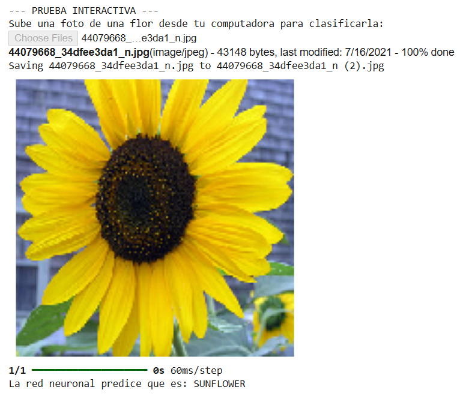
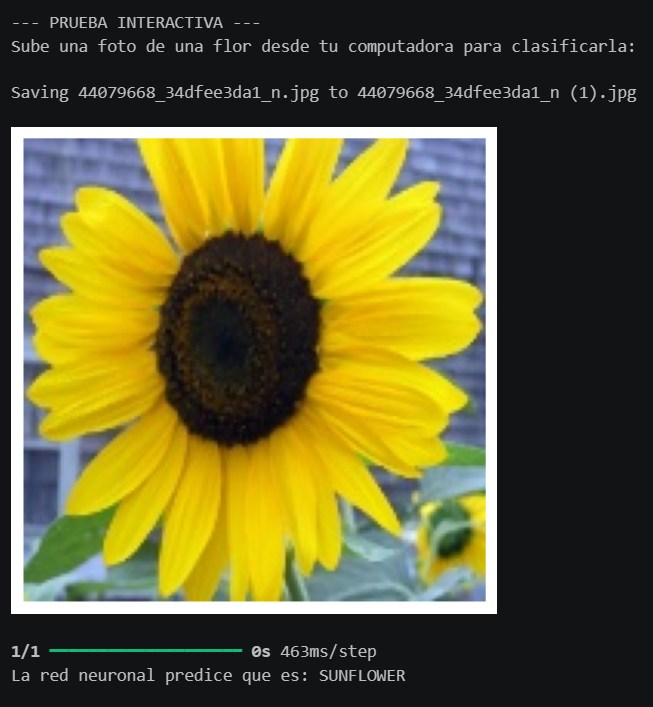
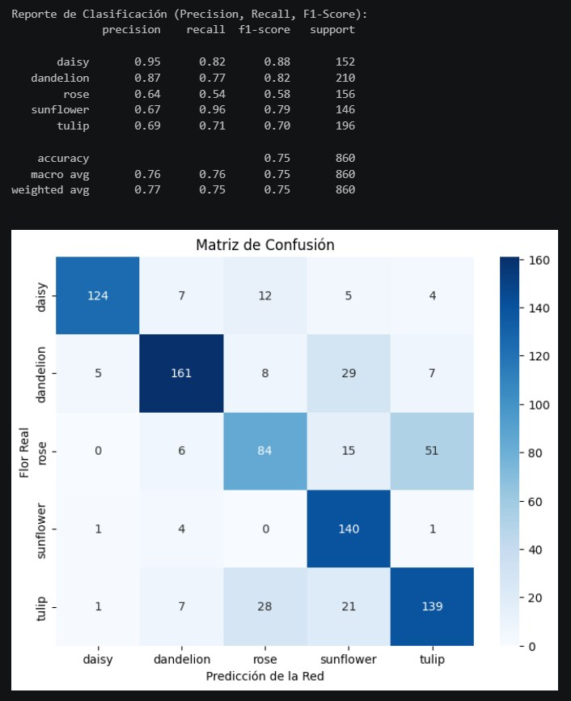
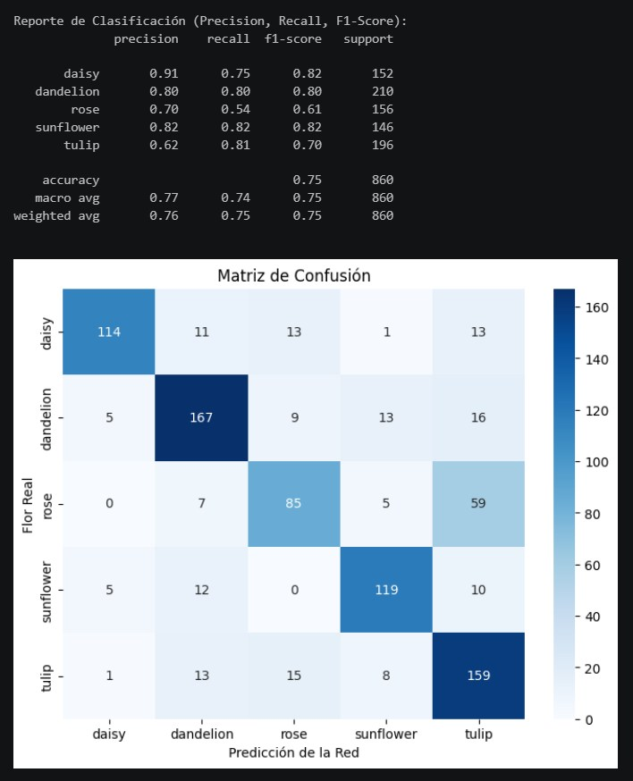
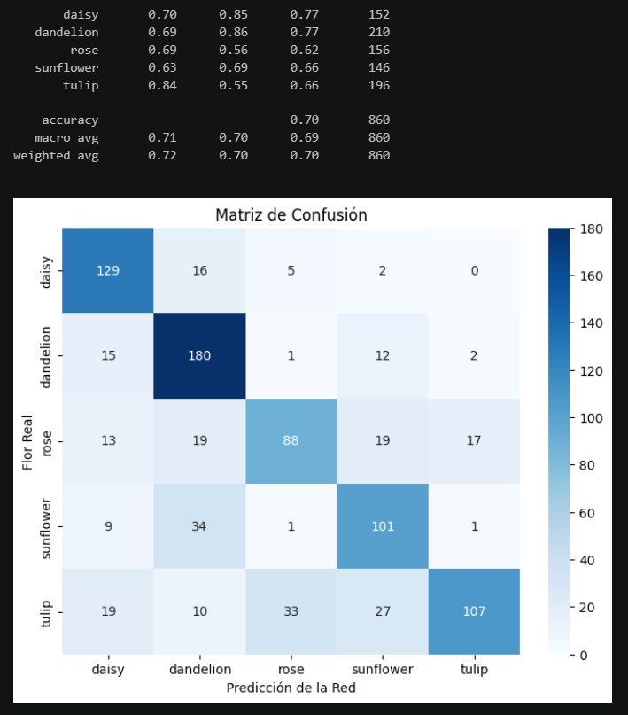

# Proyecto_Final_Sistemas_Distribuidos_CNN
En este repositorio encontrara todo lo solicitado del proyecto final CNN para el dataset flowers

## Descripción del Proyecto

El objetivo de este proyecto es analizar el impacto de diferentes técnicas de preprocesamiento de imágenes sobre el desempeño de una Red Neuronal Convolucional (CNN) para la clasificación automática de flores.

Se implementaron dos técnicas de procesamiento digital de imágenes vistas durante el curso:

1. Filtro de Mediana.
2. Ecualización del Histograma en el espacio de color HSV.

Cada técnica fue aplicada a todas las imágenes del dataset antes del entrenamiento de la CNN para evaluar su influencia en las métricas de clasificación.

---

## Dataset Utilizado

Flowers Recognition Dataset

Clases:

* Daisy
* Dandelion
* Rose
* Sunflower
* Tulip

Fuente:

https://www.kaggle.com/datasets/alxmamaev/flowers-recognition

---

## Técnicas Implementadas

### 1. Filtro de Mediana

El filtro de mediana reemplaza cada píxel por la mediana de sus vecinos dentro de una ventana determinada.

#### Objetivo

* Reducir ruido en las imágenes.
* Conservar bordes importantes.
* Mantener la forma de pétalos y hojas.

#### Beneficio esperado

Mejorar la calidad visual de la imagen eliminando pequeñas variaciones que podrían afectar el aprendizaje de la CNN.

---

### 2. Ecualización del Histograma en HSV

La imagen es convertida al espacio de color HSV y posteriormente se aplica ecualización del histograma al canal V (brillo).

#### Objetivo

* Mejorar el contraste.
* Resaltar detalles visuales.
* Mantener la información cromática de las flores.

#### Beneficio esperado

Facilitar la identificación de patrones visuales por parte de la CNN.

---

## Estructura del Proyecto

```text
Proyecto/
│
├── imagenes/
│
├── Proyecto_Final_RGB_Filtro_Mediana.ipynb
│
├── Proyecto_Final_RGB_Flowers.ipynb
│
├── Proyecto_Final_RGB_HSV.ipynb
│
├──README.md
│
├── preprocesamiento_HSV.ipynb
│
├── preprocesamiento_Filtro_Mediana.ipynb
│
└── Presentacion_Proyecto_Final_CNN.pptx
```

---

## Requisitos

## Obtención del Dataset

Antes de ejecutar los scripts de preprocesamiento es necesario descargar el conjunto de datos utilizado en el proyecto.

Dataset utilizado:

https://www.kaggle.com/datasets/alxmamaev/flowers-recognition

### Pasos

1. Ingresar al enlace del dataset en Kaggle.
2. Descargar el archivo comprimido (.zip).
3. Extraer el contenido del archivo.
4. Subir la carpeta `flowers` a tu Google Drive.
5. Verificar que la estructura de carpetas sea la siguiente:

```text
flowers/
│
├── daisy
├── dandelion
├── rose
├── sunflower
└── tulip
```

---
## Montar tu Google Drive en Google Colab

Abre Google Colab

Fuente:

https://colab.research.google.com/

Montar Google Drive

```python
from google.colab import drive
drive.mount('/content/drive')
```

---
## Entrenamiento de la CNN

1. Abrir el notebook `Proyecto_Final_RGB_Flowers.ipynb`.
2. Modificar la variable de ruta del dataset (flowers) a tu google drive.
```python
DATASET_DIR = "/content/drive/MyDrive"
```
4. Ejecutar el entrenamiento utilizando:

   * Dataset original (flowers).
   * Dataset procesado con filtro de mediana.
   * Dataset procesado con ecualización HSV.
  
5. Realizar y Guardar el resultado de una Prueba Interactiva de la sección 8. del Entrenamiento de la CNN.

6. Registrar las métricas obtenidas en cada entrenamiento.

Métricas evaluadas:

* Accuracy
* Precision
* Recall
* F1-Score
* Matriz de Confusión
---

---

## Ejecución del Filtro de Mediana

```bash
python preprocesamiento_Filtro_Mediana.ipynb
```

Resultado:

```text
flowers_preprocesadas_Filtro_Mediana/
```

---

## Ejecución de la Ecualización HSV

```bash
python preprocesamiento_HSV.ipynb
```

Resultado:

```text
flowers_preprocesadas_HSV/
```

---

## Ejemplo Visual

### Imagen Original



### Imagen Procesada con Filtro de Mediana


### Imagen Procesada con Ecualización HSV



---

## Resultados

### Modelo Original



### Modelo con Filtro de Mediana



### Modelo con Ecualización HSV



---

## Conclusiones

Este proyecto permitió analizar cómo diferentes técnicas de preprocesamiento pueden influir en la capacidad de clasificación de una CNN. Los resultados obtenidos permiten determinar cuál técnica proporciona una mejor representación de las características visuales presentes en las flores.

---

## Autor

Nombre: Gerardo Alejandro Carrillo Aguirre

Matricula: 42208760

Materia: Sistemas Distribuidos

Fecha: 05 de Junio 2026
